# 👨‍💻‍ Sobre o projeto

Dine é um restaurante fictício localizado em Cúmbria, na Inglaterra. Com uma
paisagem rural e alimentos frescos, que são produzidos localmente na própria
fazenda, Dine é o ambiente perfeito para um jantar romântico, encontros familiares,
e até mesmo grandes eventos!
A [ideia do design](https://www.frontendmentor.io/challenges/dine-restaurant-website-yAt7Vvxt7)
veio de um desafio do frontend mentor.

### 🧰 Ferramentas Utilizadas

- [Vite](https://vitejs.dev/)
- [React](https://react.dev/)
- [React Hook Form](https://react-hook-form.com/)
- [Tailwind](https://tailwindcss.com/)
- [NPM](https://docs.npmjs.com/downloading-and-installing-node-js-and-npm)

## 💿 Como rodar na sua máquina

### Pré-requisitos

- **Git**;
- **Node + NPM**;

```shell
# Clone o repositório na sua máquina
$ git clone https://github.com/lleonardus/dine-restaurant

# Abra a pasta do projeto
$ cd dine-restaurant

# Instale as dependências
$ npm i

# Inicie o projeto
$ npm run dev
```

Após esse processo, o App vai estar rodando em **http://localhost:5173**

## 📸 Screenshots

### 🖥️ Desktop

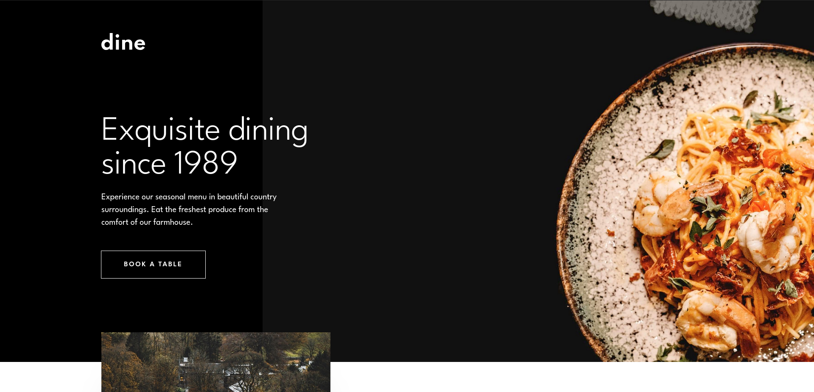
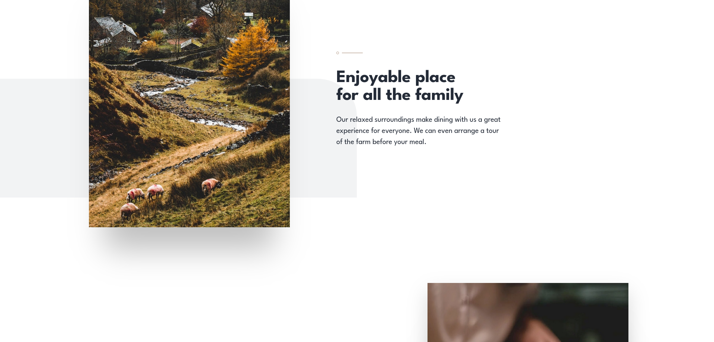
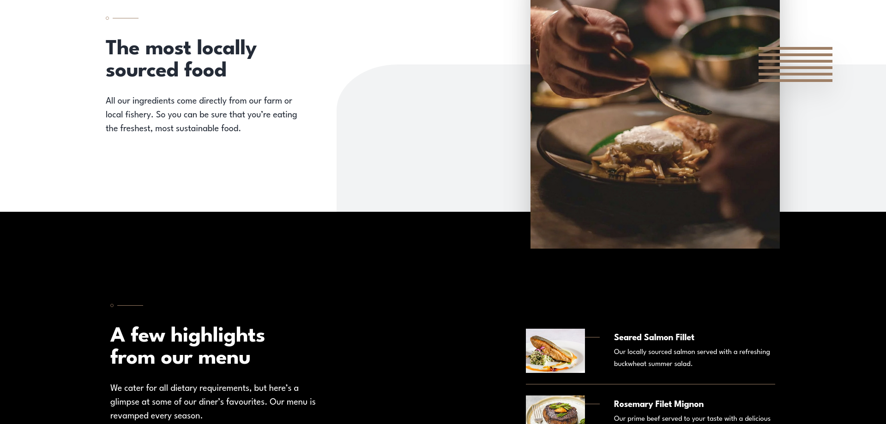
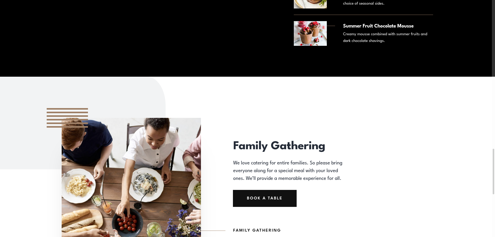
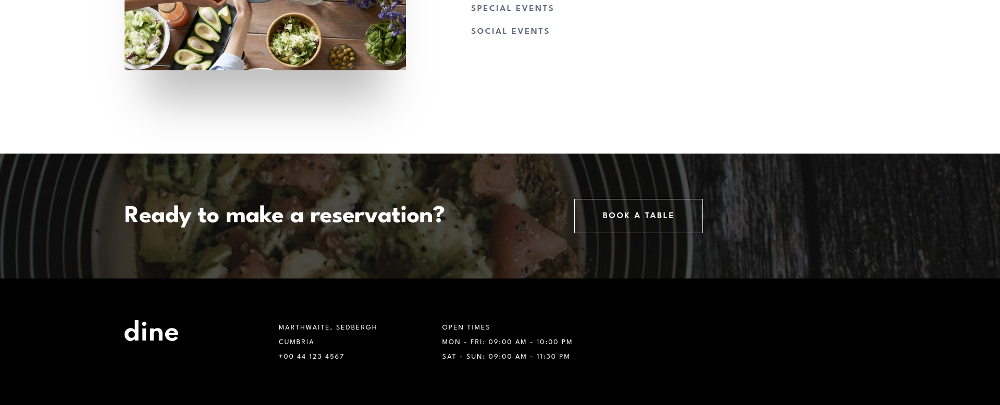
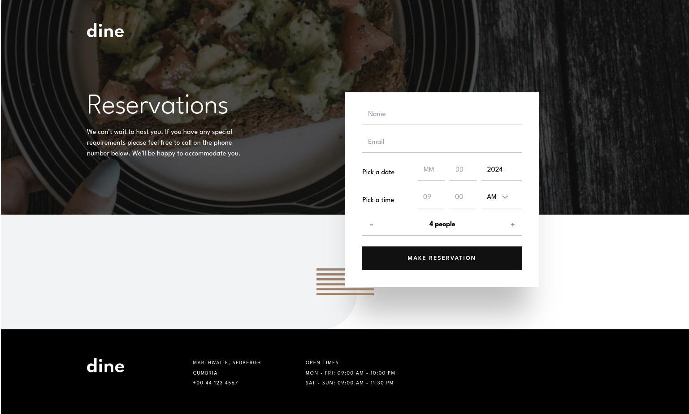

### 📱 Mobile

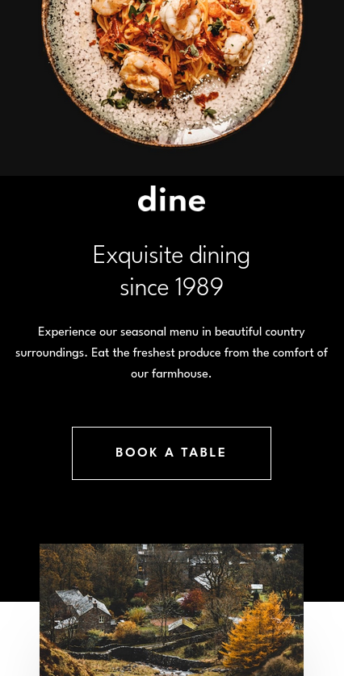
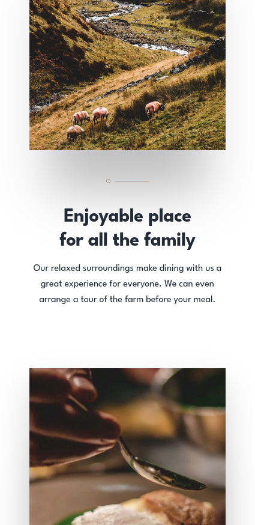
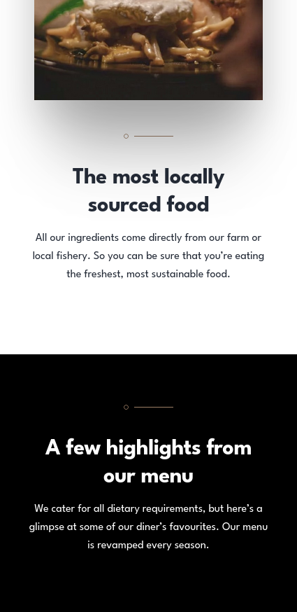
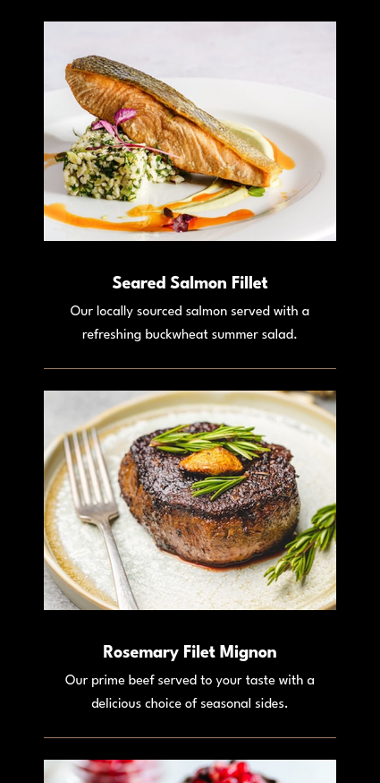
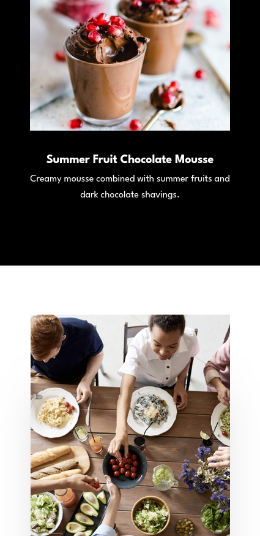
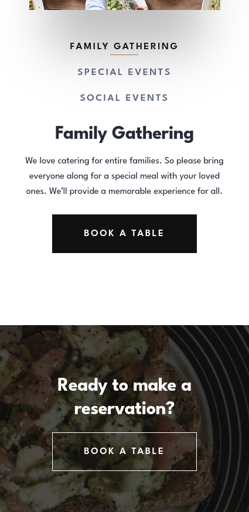
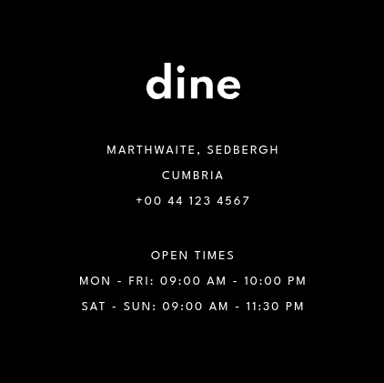
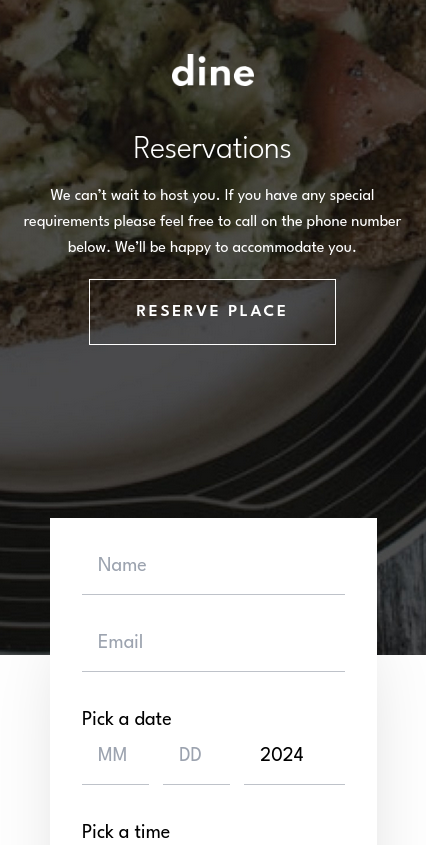
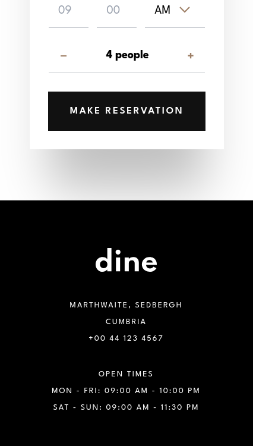
